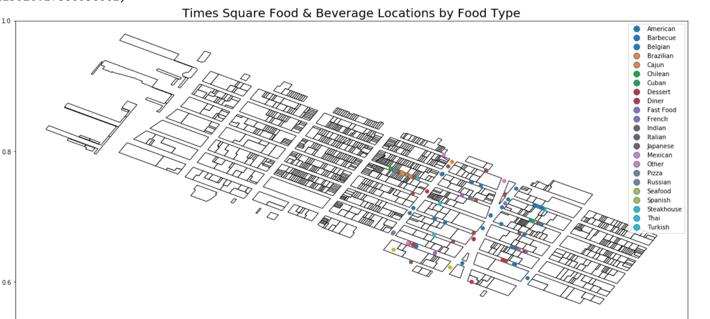
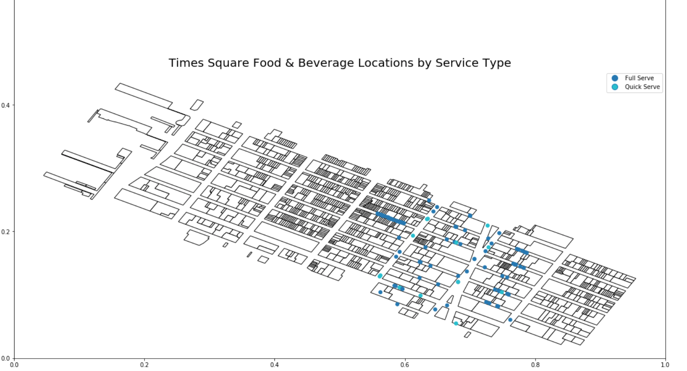

# PUI2018 HW 11

## ASSIGNMENTS:

### Assignment 1. Work from the [skeleton notebook]

This assignment aims at practicing time-series data analysis based on MTA data. It is an interesting dataset that has the number of swipes data from both 23 rideship types and 600 stations during 194 weeks (600*23*194) shape. I worked alone for the task 1 and task 2, and group work with Mingyi He in task 3. 

The first task is detecting the prominent event regarding 3 sigma. At first I am struggle with which layer of data should be used, then I found that the type/staion are not that important thing, the goal is detecting which day is abnormal, so having the sumed data over the date period is enough. The second task is detecting the trend of the time series data. I practice the "rolling_mean" method to smooth the plot, and then filter the ridership type which has increased/decreased trend. Understanding the idea behind the 3rd task is really trick for me, I took the whole afternoon ,and finally thanks Mingyi for help me clarify the meaning of the problem. I practiced calculating mean/std for array a lot, and also learned the confusion_matrix, classification_report, and feature_importances_ methods.

### Assignment 2. Improve your plot from HW8 based on the feedback you recieved from your classmates (let me know if you did not recieve feedback and I will comment on your original plot)

The original plot that I made is:

Thank you for the suggestions from sz2404 and jc9033. They all mentioned that the points are too small and there are too many empty area, so zooming into where all the food services are to reduce the overlay of dots can improve the graph. In addition, adding some streets for the location of the food services can enrich the graph. possibly added to the map to demonstrate the location of food services. The following are my modified graph.

**Figure 2** Times Square Food & Beverage Locations by Food Type and by service type. From the top graph, we can see that the food type is really diversied, and seems have no clustering pattern. My initial thought that the same cuisine tend to gather together cannot be proved by this data. From the bottom graph, the number of restaurant that has full service seems to be more than that has quick service, and the same type tend to clustring in closer space. 

