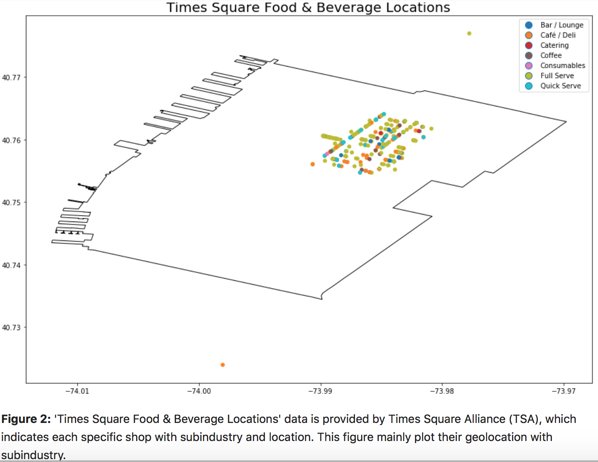
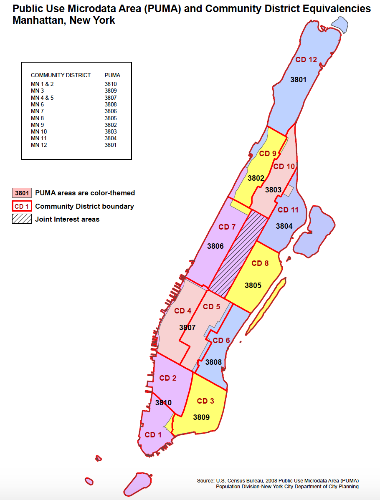

## Assignment 1:

This assignment is practice for creating a plot of whatever data I choose from data of urban relevance. 

The data that I choose is the "Time-square food and beverage" data from NYC Open Data. 

### Main plot of the paper for Correlation: 

Figure 1:  'Times Square Food & Beverage Locations' data is provided by Times Square Alliance (TSA), which indicates each specific shop with subindustry and location. This figure mainly plot their geolocation with subindustry. The number of shop which provided full service seems to be the largest amount, and the shop provided quick service tend to be at the edge of the square. 

In order to show the graph clearly, the contour map is filtered into the area in which time-square located. The PUMA area ID is sourced as following:

### Main plot of the paper for Correlation: 

## Assignment 2:
The paper is publish in Authorea. Please see the link: https://www.authorea.com/335890/-xve2Bdvi0KTLLEh5SE12A

This assignment aims at finishing citibike mini-project. The suugestion from Chang Du that "add more comments in your code for peer review" is important, I will notice this next time. 

Regarding the suggested test, although the peer review suggests to use the z-test. However, giving the hypotheses and dataset, the t-test may be more suitable. T-test is always used for testing the null hypothesis that 2 independent samples have identical average (expected) values. The 2 samples here are two types of group draw from total population, with unknown population mean and standard deviation. Therefore, the objective of this test is not testing the sample drawn belongs to the same population but comparing the mean of two given samples. In addition, the sample size just around 30 so it's not a large sample size. Therefore, finally I choose the t-test.

On contrast, I am not understand why peer ab8131 comments that " there is only 2 people who born before 1980 and 3 people who born after 1980 in your data" since I have large number of people each day. 